# FHDportal Docker Demonstrator

This standalone demonstrator application showcases the Federated Human Data (FHD) web portal for dataset submission to a Federated European Genome-Phenome Archive (FEGA) node. It was initially developed by the SIB Swiss Institute of Bioinformatics for the Swiss FEGA node.

***

## Prerequisites

- Docker and Docker Compose installed on your system
- Basic familiarity with Docker commands

***

## Getting Started

1. **Clone the repository:**

```bash
git clone git@github.com:rliechti/fhdportal-docker.git
cd fhdportal-docker
```

2. **Build and start the Docker containers:**
To run in the foreground:

```bash
docker-compose up --build
```

To run in the background (detached mode):

```bash
docker-compose up --build -d
```

3. **Open the portal in your browser:**
[http://localhost:5173](http://localhost:5173)

***

## User Tutorial

### Register and Setup Roles

1. Navigate to the **Submitter Portal**.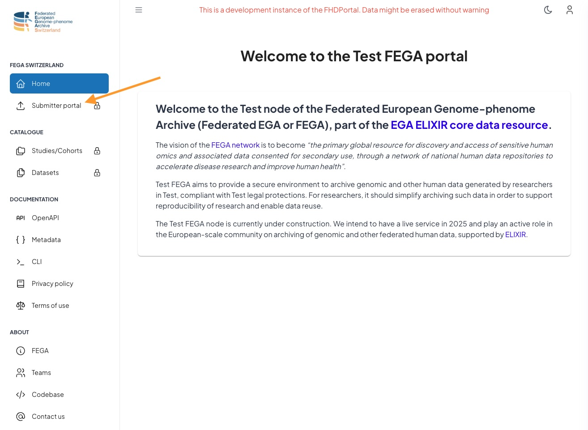
2. Click the **Register** link at the bottom of the page.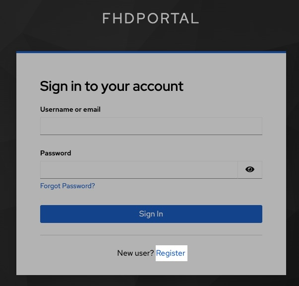
3. Complete the registration form. (You may leave `SSH Public Key` and `C4GH Public Key` empty initially.)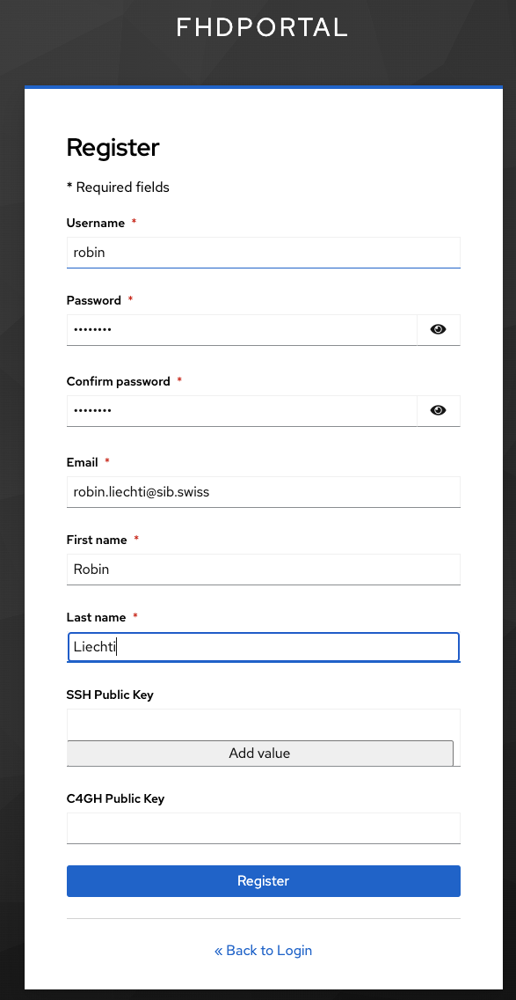
4. After registering, request the **Submitter Role** by clicking the corresponding button. A green confirmation message will appear.
5. *(In production mode)* This request sends an email to the FEGA helpdesk. This demonstrator uses [MailHog](http://localhost:8025) as a fake mail server for testing. Check the inbox at [http://localhost:8025](http://localhost:8025).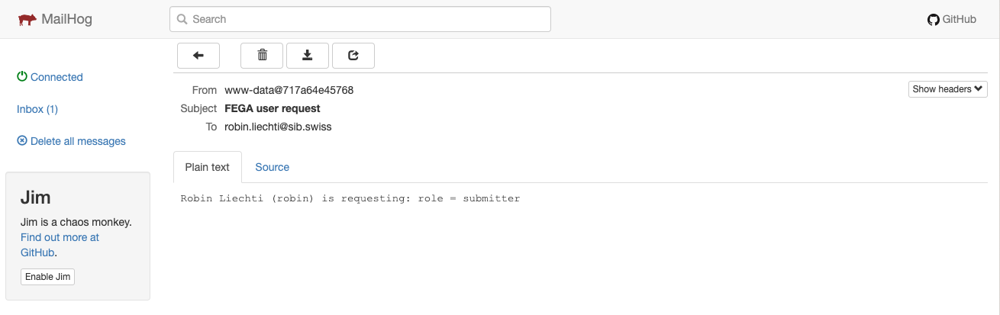

### Admin Setup for Role Management

6. A **fega-admin** account must exist to manage roles. For initial setup, use the Keycloak admin interface:
    - Access Keycloak at [http://localhost:8080](http://localhost:8080)
    - Log in with default credentials:
        - Username: `admin`
        - Password: `password`
7. In Keycloak:
    - Select **Manage Realms** then click on **fhdportal**.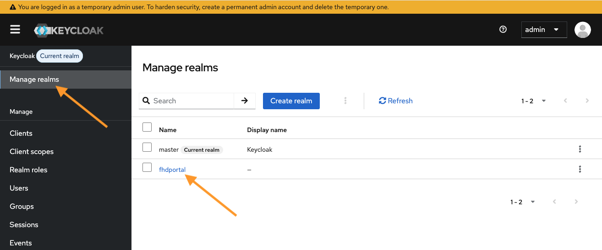
    - Go to **Users** and select your username.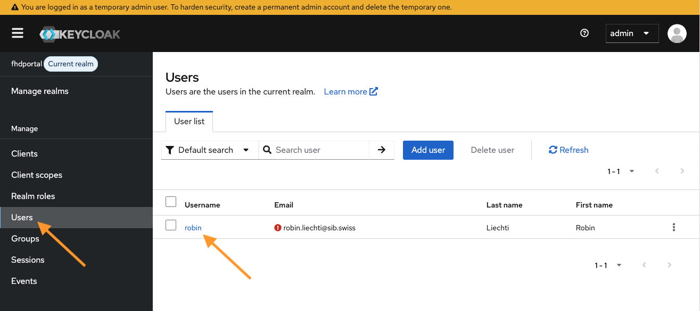
    - Go to **Role Mapping**, click **Assign Role** → **Realm Roles**, choose **admin-fega**, and click **Assign**.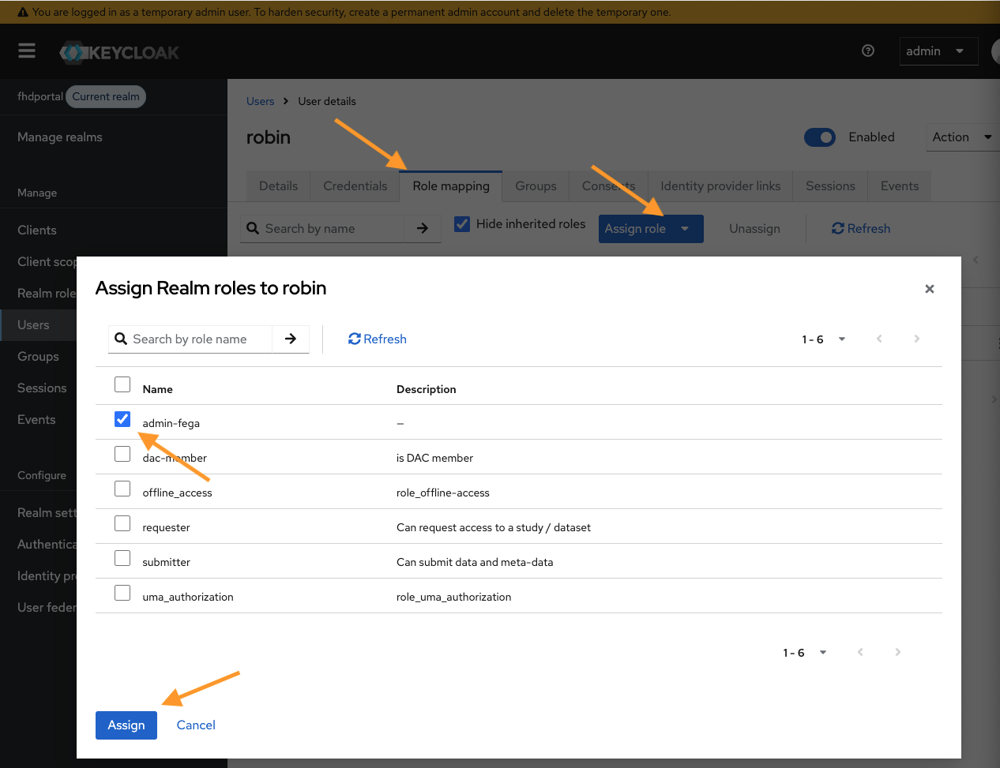
8. Return to the FHDportal ([http://localhost:5173](http://localhost:5173)) and reload the page.
9. You should now see an **Admin** → **Users** menu. Use it to toggle the **Submitter** role for your user. 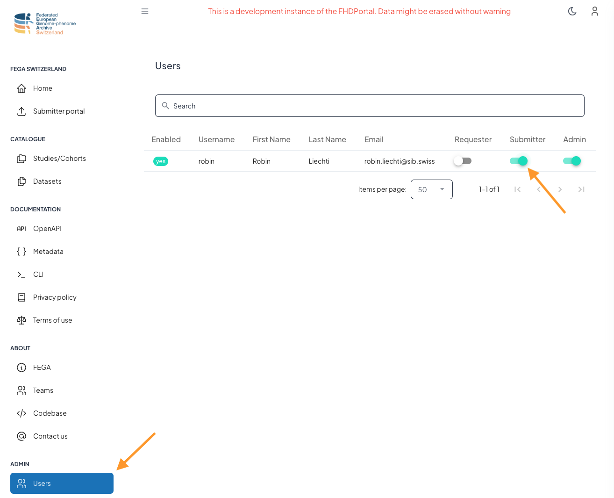

### SSH Key Registration

10. Return to the **Submitter Portal** and reload the page.
11. Register your SSH public key. (*Note: SSH keys are not used in this demonstrator but are required in production for Secure Data Archive authentication.*)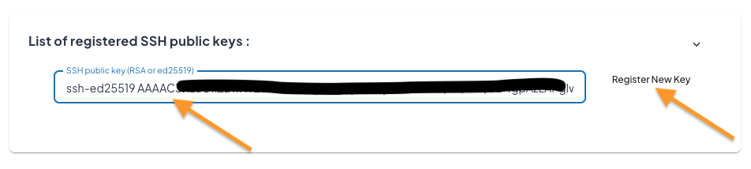
12. Reload the page to reveal the submission button.
13. Click **Submit a New Study** to start your dataset submission.

***

## Importing Encrypted Files into Secure Data Archive (SDA-Inbox)

14. In this demonstrator, encrypted files (*.c4gh) must be manually copied into subdirectories within the `sda-inbox` directory.

15. Create an inbox directory named after your registered email:

```bash
cd sda-inbox
mkdir your.email@example.com
```

16. Copy or move your `*.c4gh` files into this inbox:

```bash
cd your.email@example.com
cp ../../fhdportal-example/RCC/files/*.c4gh .
```

17. A cron job running every minute scans these directories and updates the FHDportal database accordingly. **Wait one minute before proceeding.**

***

## Batch Submission Process

15. Click on **Large Submissions in Batch**.
16. Upload the example bundle `RCC.zip`.
17. After validation, click **Close**.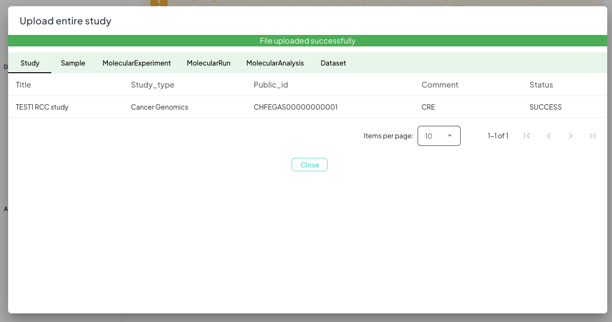
18. Explore your submission across the tabs: **Study, Samples, Experiments, Runs, Analyses, Datasets**.

***

## Completing the Submission

19. On the **Datasets** tab, associate a **Policy** for each dataset:
    - Click the **POLICY** button.
    - Select **Test Policy FHD** and click **Set Policy**.
    *(Note: In FEGA production, a separate DAC portal handles Policies. Here, a fake REST API serves this function.)*
20. Once policies are set for all datasets, a **Submit Study...** button will appear.
21. Click it to submit and confirm your study.
22. Submission approval occurs automatically within one minute (production mode uses DAC portal for approval).
23. Reload the page; the dataset status should update to **published**.

***

## Viewing Submissions

24. Go to **Catalogue** → **Studies/Cohorts** to find your submission listed.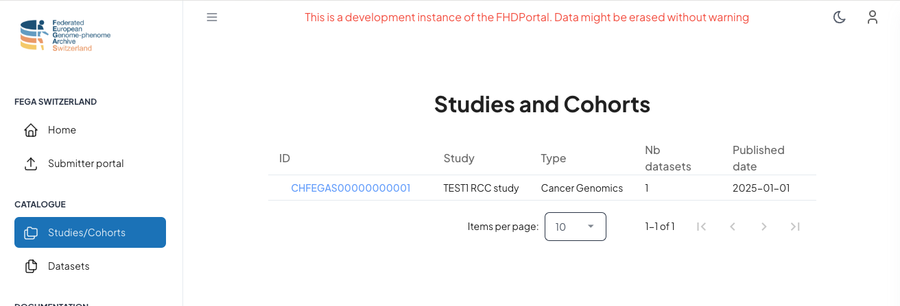
25. Click your submission to view detailed information.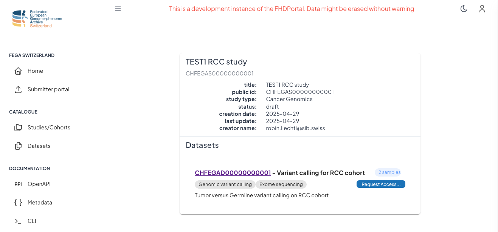
